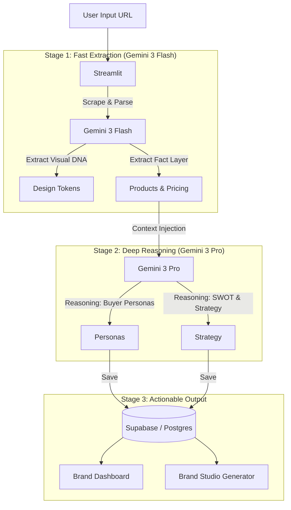

# BrandOS 🚀
**The AI-Powered Operating System for Modern Brands**

[](https://gemini3.devpost.com/)
[](https://deepmind.google/technologies/gemini/)
[](https://brand-os.streamlit.app/)

> **[🔴 Try It Live (Streamlit Cloud)](https://brand-os.streamlit.app/)** | **[📺 Watch the Demo Video](https://youtu.be/BCnZtiLxuyI?si=MilC-7Pctcdr2H3S)**

---

### ❓ The Problem
Brands today are drowning in data but starving for insight. Traditional tools give you metrics; they don't give you **strategy**. You know *what* your competitors are doing, but not *how* to beat them.

### 💡 The Solution: BrandOS
BrandOS is a **living intelligence layer** for your brand. We use the deep reasoning capabilities of **Gemini 3 Pro** to not just analyze your brand, but to *think* like your Chief Strategy Officer.

#### ⚡ Powerhouse Features
1.  **🧬 Decode Your Brand's Soul**: Don't just get data. Understand the *psychology* of your buyers. We extract your unique Voice, Archetype, and Core Values to build a strategy that feels human.
2.  **🤖 Dominate the AI Era**: SEO is the past. We analyze how **ChatGPT, Perplexity, and Gemini** see you, giving you the playbook to become the "referenced authority" in AI answers.
3.  **🎨 Instant Visual Legacy**: Stop using generic stock photos. Brand Studio generates stunning, on-brand assets that align perfectly with your aesthetic identity.
4.  **🚀 Content That Converts**: Feed generic copy into the Optimizer and watch it transform into high-converting gold, written specifically in *your* Brand Voice.

---

### 🧠 Deep Reasoning Architecture
BrandOS isn't a wrapper; it's a multi-stage reasoning engine.



**Why Gemini 3?**
*   **Gemini 3 Flash**: Handles the heavy lifting of real-time HTML parsing and visual extraction with low latency.
*   **Gemini 3 Pro**: The "Deep Reasoner" that spends time thinking through complex buyer psychographics and competitive wedges that standard models miss.

---

### 🏆 Hackathon Submission Details
*   **Hackathon Track:** Strategic Agent / Deep Reasoning
*   **Prompt Alignment:** "Marathon Agent" - BrandOS acts as a long-running strategist, maintaining state and reasoning through complex brand problems over time.
*   **Tech Stack:**
    *   **Frontend:** Streamlit
    *   **AI:** Google Gemini 3 Pro & Flash (via Google GenAI SDK)
    *   **Database:** Supabase (PostgreSQL + SQLAlchemy)
    *   **Backend:** Python


### 🛠️ Local Developer Setup (Optional)
*For judges or developers who want to inspect the code or run it locally.*

1.  **Clone the repository**
    ```bash
    git clone https://github.com/RevanthRaman/BrandOS.git
    cd BrandOS
    ```

2.  **Install Dependencies**
    ```bash
    pip install -r requirements.txt
    ```

3.  **Set up Environment**
    Create a `.env` file in the root directory:
    ```env
    GEMINI_API_KEY=your_google_api_key
    DATABASE_URL=your_supabase_postgres_url
    ```

4.  **Run the App**
    ```bash
    streamlit run app.py
    ```

### 👨‍💻 Author
**Revanth Raman** - [LinkedIn](https://www.linkedin.com/in/revanthraman/)

### License
This project is licensed under the **Apache License 2.0** - see the [LICENSE](LICENSE) file for details.

**Credit Requirement:**
Per Section 4 of the Apache License 2.0, you **MUST** retain the copyright notice and the `NOTICE` file. Any use of this code must credit **Revanth Raman** as the original author.

---
